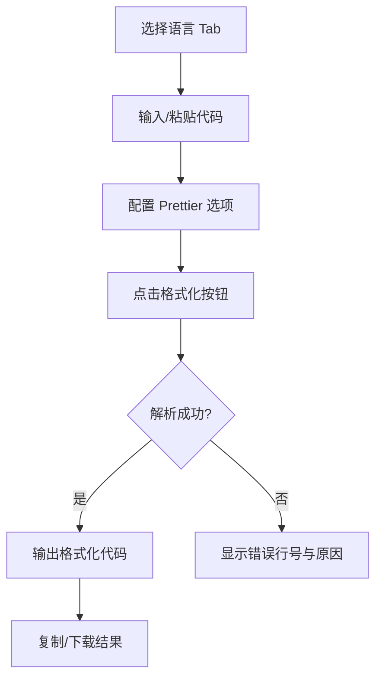

## 1. 产品概述

CodeBeautify Pro 是一款离线可用的多语言代码格式化与美化工具，对标 CodeBeautify 的增强版。支持 HTML、CSS、SCSS、JavaScript、TypeScript、JSON、XML、SQL、Markdown 等多种语言的一键格式化与压缩，集成 Autoprefixer 和多种实用开发工具。

- 核心价值：为开发者提供一站式代码美化解决方案，无需联网即可使用
- 目标用户：前端/后端开发者、网页设计师、需要处理代码格式的技术人员

## 2. 核心功能

### 2.1 用户角色
| 角色 | 注册方式 | 核心权限 |
|------|----------|----------|
| 普通用户 | 无需注册 | 使用所有格式化、压缩、工具功能 |

### 2.2 功能模块
1. **主编辑器视图**：多语言 Tab 切换、左侧输入右侧输出双栏布局
2. **格式化功能**：Prettier 驱动、可配置选项、语法错误友好提示
3. **压缩功能**：多语言压缩、压缩率显示、安全默认配置
4. **Autoprefixer 视图**：独立 Tab、CSS 前缀自动添加、Diff 高亮显示
5. **实用工具视图**：6 种常用开发工具卡片集合
6. **操作功能**：复制、下载、交换、清空、键盘快捷键
7. **编辑器增强**：行号、代码折叠、括号匹配、明暗主题

### 2.3 页面详情
| 页面名称 | 模块名称 | 功能描述 |
|----------|----------|----------|
| 主编辑器视图 | 语言 Tab 栏 | 9 种语言快速切换，自动检测语言 |
| 主编辑器视图 | 左侧控制面板 | Prettier 选项配置、显示选项、操作按钮 |
| 主编辑器视图 | 双栏编辑器 | 输入输出同步滚动、字符计数、压缩率显示 |
| 主编辑器视图 | 状态栏 | 语法错误提示、行号定位、状态信息 |
| Autoprefixer 视图 | 配置栏 | Browserslist 查询输入、运行按钮 |
| Autoprefixer 视图 | Diff 输出 | 新增前缀行高亮显示、统计信息 |
| 实用工具视图 | 工具卡片网格 | CSS 颜色转换、px↔rem、HTML 转义、Babel、JSON 工具、Base64 |

## 3. 核心流程

用户选择语言 → 粘贴或输入代码 → 点击格式化/压缩按钮 → 查看输出结果 → 复制或下载

## 4. 用户界面设计

### 4.1 设计风格
- **主色调**：蓝色系 `#3b82f6` 作为主题色，紫色 `#8b5cf6` 作为特殊 Tab 强调色
- **按钮样式**：扁平化设计，小圆角（4px），边框清晰，悬停有状态反馈
- **字体**：系统无衬线字体 + 等宽编程字体（SFMono-Regular, Consolas）
- **布局风格**：三栏布局（侧栏控制面板 + 双编辑器），顶部导航 + 底部状态栏
- **图标风格**：Emoji 图标，简洁直观，与功能语义匹配

### 4.2 页面设计概述
| 页面名称 | 模块名称 | UI 元素 |
|----------|----------|----------|
| 主编辑器视图 | 整体布局 | 固定高度 100vh，Flex 垂直布局，顶部 Header + Tab 栏 + 主内容区 + 底部状态栏 |
| 主编辑器视图 | 编辑器 | CodeMirror 5.x 驱动，行号、折叠槽、括号匹配、活动行高亮 |
| 主编辑器视图 | 控制面板 | 分组卡片式布局，操作按钮区 + Prettier 选项区 + 显示选项区 |
| Autoprefixer 视图 | Diff 显示 | 行级对比，绿色背景高亮新增前缀行，统计新增行数 |
| 实用工具视图 | 工具卡片 | 网格布局（auto-fill minmax 340px），卡片悬停阴影效果，淡入动画 |

### 4.3 响应式
- **桌面端优先**：≥900px 标准三栏布局
- **平板端**：768px-900px 缩小侧栏宽度，调整内边距
- **移动端**：≤768px 垂直堆叠布局，控制面板横向排列
- **小屏手机**：≤480px Tab 栏可换行，Autoprefixer 配置垂直排列

### 4.4 交互与动画
- 状态栏淡入动画（0.2s ease）
- 工具卡片依次淡入（0.3s ease）
- 按钮悬停状态过渡（0.15s ease）
- Tab 激活底部指示条
- 主题切换平滑过渡（CSS 变量）
