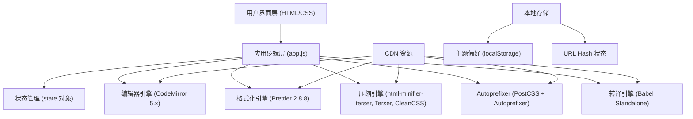

## 1. 架构设计

纯前端单页应用，无后端依赖，所有库通过 CDN 引入，支持离线使用（首次加载后）。



## 2. 技术描述

- **前端架构**：原生 JavaScript + HTML5 + CSS3，无框架依赖
- **初始化方式**：直接打开 index.html，无需构建工具
- **代码编辑器**：CodeMirror 5.65.16，支持语法高亮、行号、折叠、括号匹配
- **格式化引擎**：Prettier 2.8.8 (standalone) + 各语言 parser 插件
- **压缩工具**：
  - HTML: html-minifier-terser 6.1.0
  - JS: Terser 5.19.2
  - CSS: clean-css 5.3.2
- **Autoprefixer**：PostCSS 8.4.31 + Autoprefixer 10.4.16 + Browserslist 4.22.1
- **转译工具**：@babel/standalone 7.23.5
- **数据存储**：localStorage（主题） + URL Hash（语言与选项状态）

## 3. 文件结构

| 文件 | 行数 | 职责 |
|------|------|------|
| [index.html](file:///Users/ext.feixuan3/Desktop/solo/pro_10/index.html) | 328 | 页面结构、CDN 资源引入、DOM 元素定义 |
| [styles.css](file:///Users/ext.feixuan3/Desktop/solo/pro_10/styles.css) | 860 | 全局样式、主题变量、响应式布局、组件样式 |
| [app.js](file:///Users/ext.feixuan3/Desktop/solo/pro_10/app.js) | 1248 | 核心业务逻辑、状态管理、事件绑定、工具函数 |

## 4. 核心模块设计

### 4.1 状态管理模块 (app.js L8-L24)

```javascript
const state = {
  currentLang: 'html',
  currentView: 'editor',
  theme: 'light',
  options: { /* Prettier 选项与显示选项 */ }
};
```

### 4.2 语言配置模块 (app.js L27-L91)

定义 9 种语言的配置：
- CodeMirror mode
- Prettier parser
- 文件扩展名
- MIME type
- 示例代码

### 4.3 编辑器管理模块 (app.js L180-L237)

- `createEditor()`: 创建 CodeMirror 实例
- `initEditors()`: 初始化三个编辑器实例
- 同步滚动、字符计数监听

### 4.4 格式化引擎 (app.js L345-L467)

- `formatCode()`: Prettier 格式化主入口
- `getPrettierPlugins()`: 动态加载对应语言的 parser 插件
- `parsePrettierError()`: 错误解析与行号提取
- `formatSQL()`: SQL 专用格式化（无 Prettier parser）

### 4.5 压缩引擎 (app.js L469-L595)

- `minifyCode()`: 压缩主入口，根据语言分发
- `minifyHTML()`: html-minifier-terser，压缩内联 CSS/JS
- `minifyCSS()`: CleanCSS level 2
- `minifyJS()`: Terser，默认关闭 mangle（安全）
- `minifyXML()` / `minifySQL()`: 简单正则压缩

### 4.6 Autoprefixer 模块 (app.js L597-L675)

- `runAutoprefixer()`: PostCSS + Autoprefixer 处理
- `renderDiff()`: 行级 Diff 渲染，高亮新增行
- 统计新增前缀行数

### 4.7 实用工具模块 (app.js L677-L949)

1. **CSS 颜色转换**：hex ↔ rgba ↔ hsl
2. **px ↔ rem**：支持多值批量转换，根字号可配
3. **HTML 实体转义**：转义/反转义
4. **Babel 转 ES5**：@babel/standalone
5. **JSON 工具**：校验、键排序、扁平化
6. **Base64 编解码**：支持中文

### 4.8 操作功能模块 (app.js L951-L1015)

- `swapContent()`: 交换左右内容
- `clearAll()`: 清空编辑器
- `copyOutput()`: 复制到剪贴板（含回退方案）
- `downloadFile()`: Blob 下载

### 4.9 URL Hash 状态管理 (app.js L1017-L1071)

- `saveStateToHash()`: Base64 编码状态到 URL hash (<4KB)
- `loadStateFromHash()`: 从 hash 恢复语言、视图、选项
- 支持分享链接保持状态

### 4.10 主题系统 (app.js L143-L178)

- CSS 变量驱动的主题切换
- localStorage 持久化
- 跟随系统偏好
- CodeMirror 主题同步

## 5. 关键技术决策

### 5.1 为什么选择 CodeMirror 5.x 而非 6.x
- 更成熟的生态系统，更多现成插件（折叠、括号匹配等）
- CDN 资源更稳定，无需构建
- 更小的体积，更快的加载速度

### 5.2 为什么使用 CDN 而非本地打包
- 无需构建工具，开箱即用
- 利用浏览器缓存，重复访问更快
- 代码库体积小，便于分发

### 5.3 安全默认配置
- Terser `mangle: false`：避免变量名混淆导致的运行时错误
- Prettier `trailingComma: 'es5'`：最广泛的兼容性
- 不自动格式化，需用户主动触发

### 5.4 URL Hash 限制
- Base64 编码后 <4KB，避免 URL 过长问题
- 仅存语言、视图、选项，不存代码内容

## 6. 键盘快捷键

| 快捷键 | 功能 |
|--------|------|
| `Ctrl/Cmd + Enter` | 格式化代码 |
| `Ctrl/Cmd + Shift + M` | 压缩代码 |

## 7. 依赖库清单

| 库 | 版本 | 用途 | CDN 地址 |
|----|------|------|----------|
| CodeMirror | 5.65.16 | 代码编辑器 | jsdelivr |
| Prettier | 2.8.8 | 代码格式化 | jsdelivr |
| html-minifier-terser | 6.1.0 | HTML 压缩 | jsdelivr |
| Terser | 5.19.2 | JS 压缩 | jsdelivr |
| clean-css | 5.3.2 | CSS 压缩 | jsdelivr |
| PostCSS | 8.4.31 | CSS 处理 | jsdelivr |
| Autoprefixer | 10.4.16 | CSS 前缀 | jsdelivr |
| Browserslist | 4.22.1 | 浏览器查询 | jsdelivr |
| @babel/standalone | 7.23.5 | ES6+ 转译 | jsdelivr |
